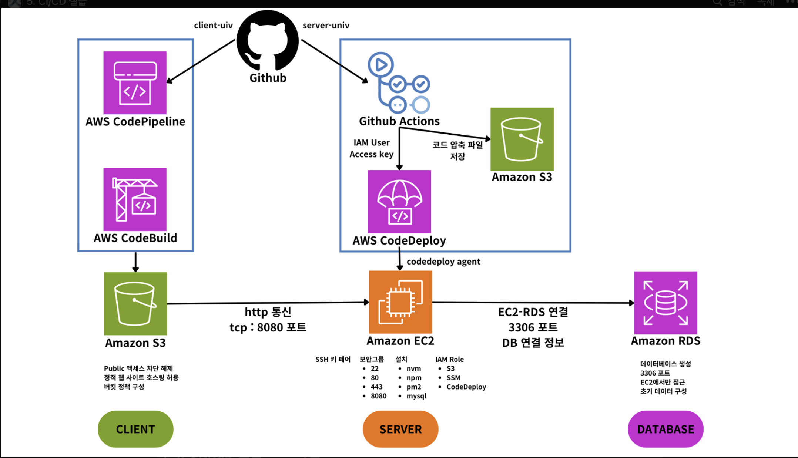

# README: 빌드-배포 자동화 실습.

## 

이 과정은 인하대학교 클라우드 컴퓨팅 과정에서 코드스테이츠 이정훈, 김은아 강사님께서 진행한 수업의 자료를 바탕으로 재구성한 것입니다.

- 위 아키텍처를 가진 웹사이트의 클라이언트와 서버의 빌드-배포를 자동화 해봅시다.
- Github 레포지토리에 클라이언트 코드 또는 서버 코드를 변경하는 것을 Trigger하면, 빌드-배포 과정을 자동화해서 처리 할 겁니다.
- 사용하는 기능은 Aws CodePipeline, Aws CodeBuild, AWS CodeDeploy와, Github에서 빌드 자동화를 위한 Github Action까지 사용해보도록 하겠습니다.

- 소스코드는 제 Github repository에 있으니, 이를 이용하고 STEP0부터 차근차근 따라오시면 됩니다.

- cgtest
