# Step1- (클라이언트) 정적 웹사이트 배포를 위한 S3버킷 권한 구성하는 방법

---

빌드 배포 자동화를 위한 포스팅에서, 정적 웹사이트 배포하는 단계입니다.

- S3로 정적 웹사이트 배포하기 위해 권한 설정 어떻게 해야하는지 궁금하신 분들도 읽어봐도 괜찮을듯 합니다.

이번 실습에서는 클라이언트 측 인터페이스를 배포하기 위해, **AWS S3버킷의 권한을 적절히 설정**해 볼겁니다.

## 1. S3버킷 만들기

---

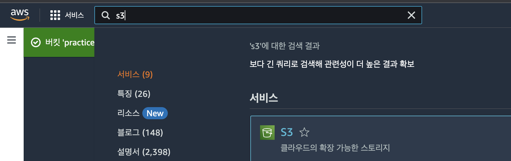

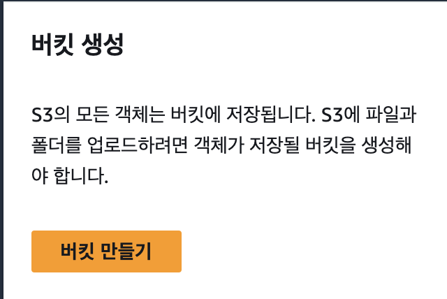

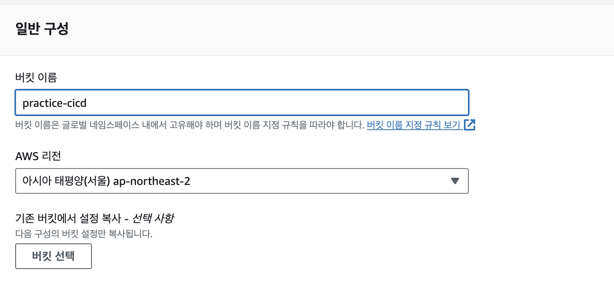

**매우 중요:** 리전을 일관되게 해야 함!

실습 중에도 많은 사람들이 리전을 일관되지 않게 선택하는 바람에 이전 단계로 자꾸 다시 돌아갔는데(저도), 애매하다면 모든 단계에서 저랑 똑같이 서울리전을 선택해서 해주도록 합니다.

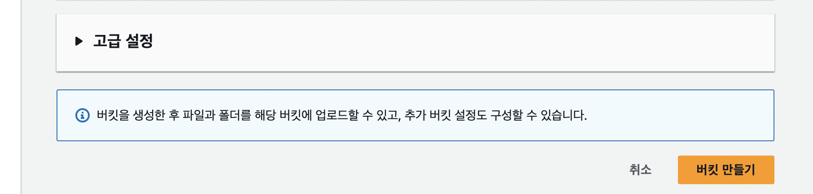

아무것도 건드리지 말고, 최하단으로 내려가서 버킷 만들기를 해줍니다. 정적 웹사이트를 호스팅하려면 몇 가지 단계가 더 필요하지만, 차후에 설정하는 방식으로 하는게 배우는 측면에서 더 좋은 것 같습니다.

## 2. S3버킷 속성에서 정적 웹사이트 호스팅 활성화 해주기

---

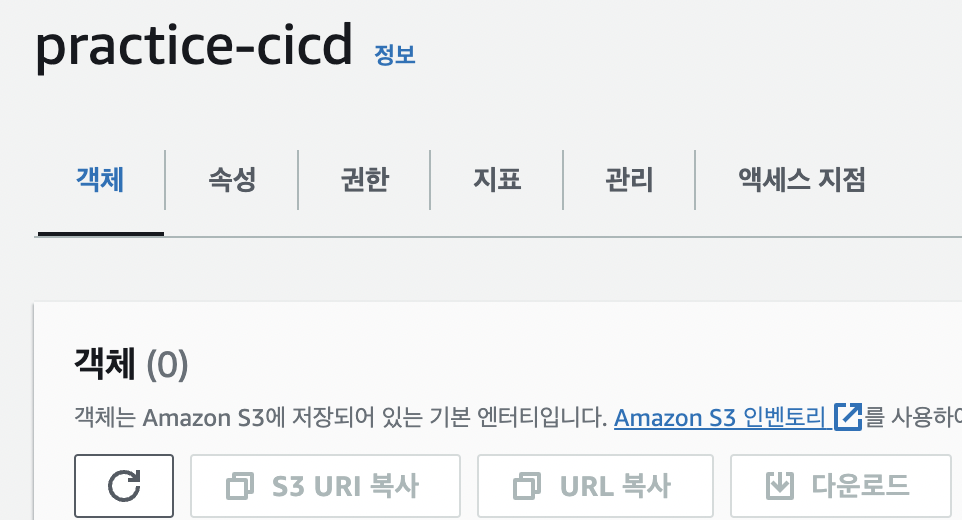
여기서 속성 탭으로 넘어가서

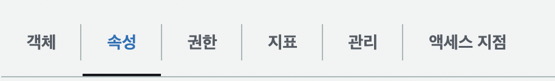

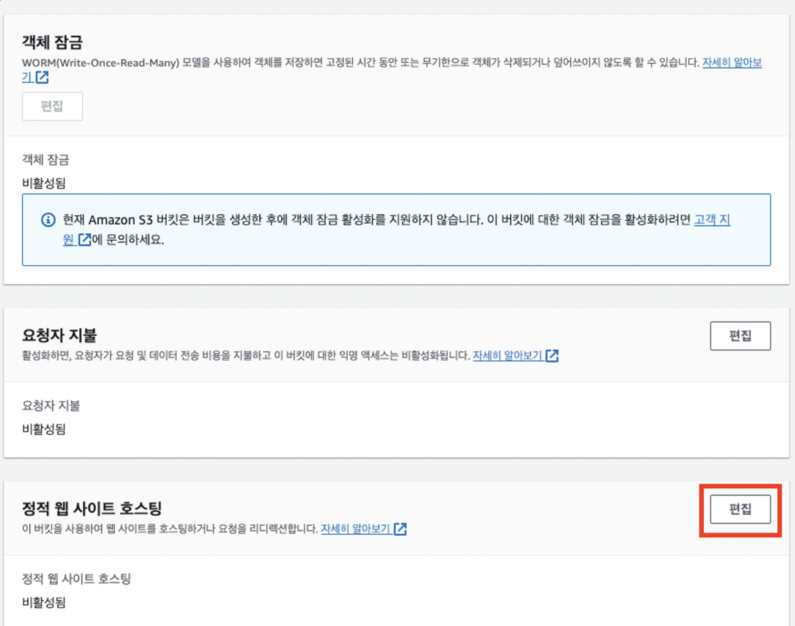

맨아래에 있는 ‘정적 웹사이트 호스팅’ 항목의 ‘편집’버튼을 눌러줍니다.

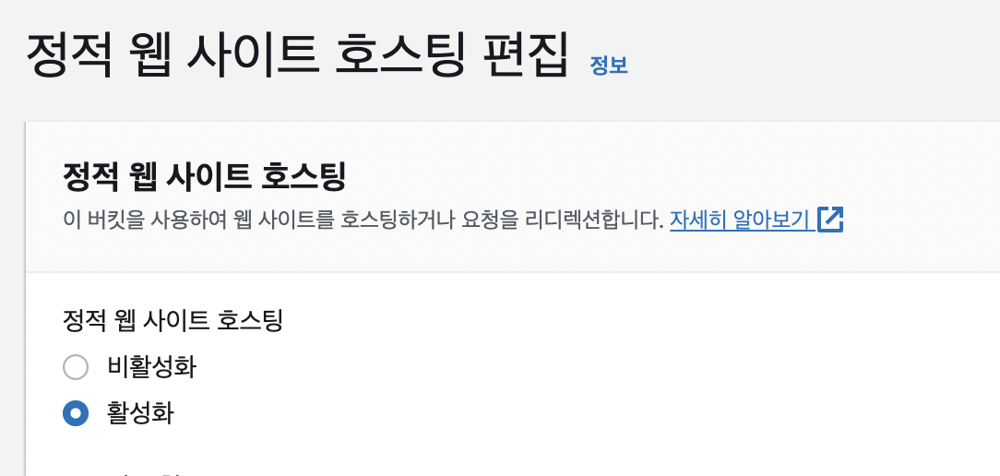

‘활성화’로 바꿔주시면 아래 항목이 몇개 더 뜰텐데

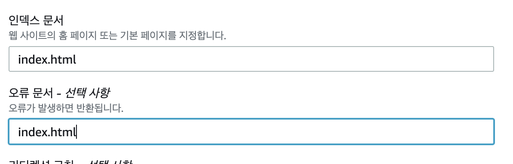

아래는 이렇게 채워주시면 여기선 끝입니다. ‘변경사항 저장’버튼을 눌러주시면 끝.

## 3. 권한/정책 설정하기

---

가장 중요한 부분. 이제 ‘권한’탭으로 넘어갑니다.

여기서, 퍼블릭 액세스 차단 ‘편집’에 들어가서 차단 해제를 눌러줄겁니다. 아래 사진처럼 하시면 됩니다.

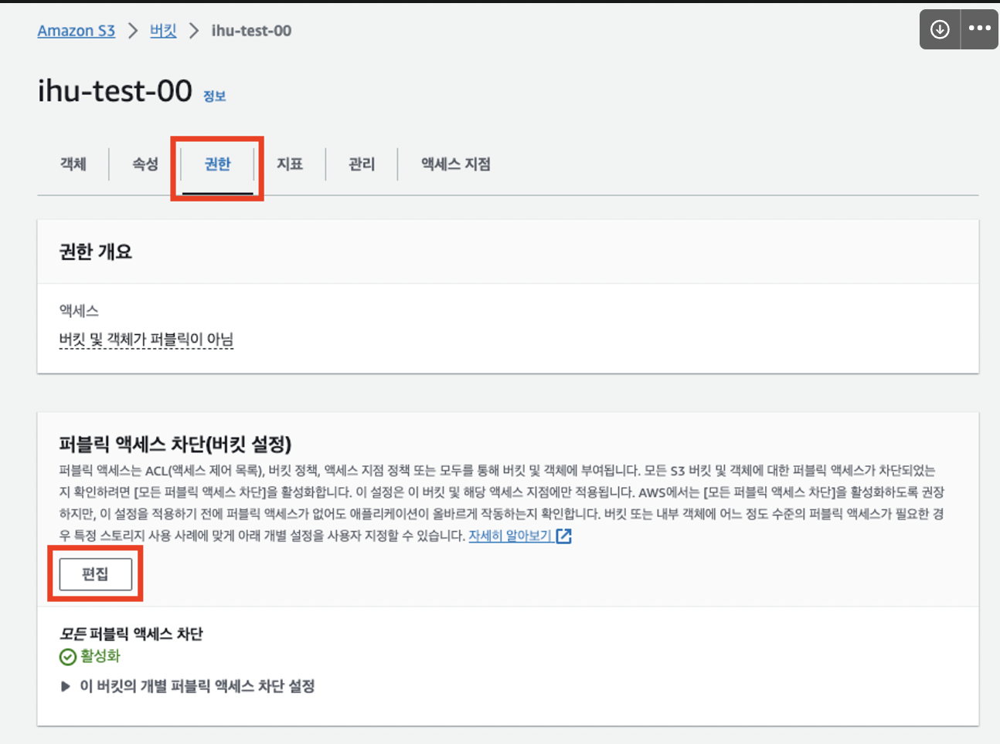

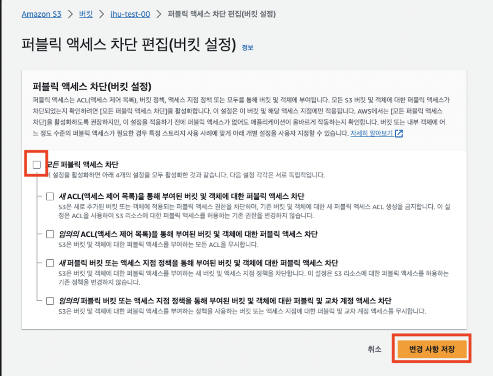

여기까지 잘 하셨다면, 아래처럼 액세스 차단 ‘비활성’이 뜰 것이고, 이제 버킷 정책으로 들어가서 액세스 권한을 설정해 줘야합니다. 제가 배포하고싶은 웹사이트에 들어갈 수 있는 권한을 설정해주는 작업입니다.

우선 버킷 정책 편집을 눌러주시고,

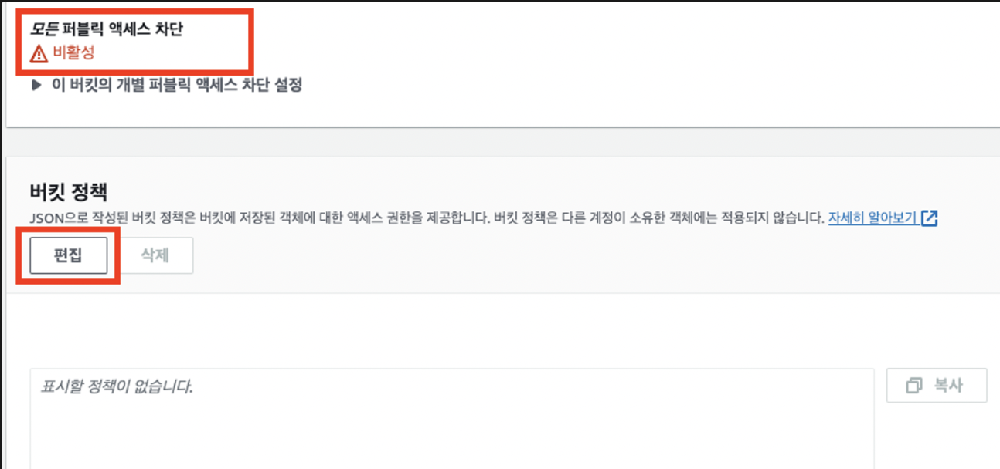

이제 버킷 정책을 생성해야합니다. ARN의 복사 버튼을 눌러주시고, 정책 생성기로 웹사이트로 들어갑니다.

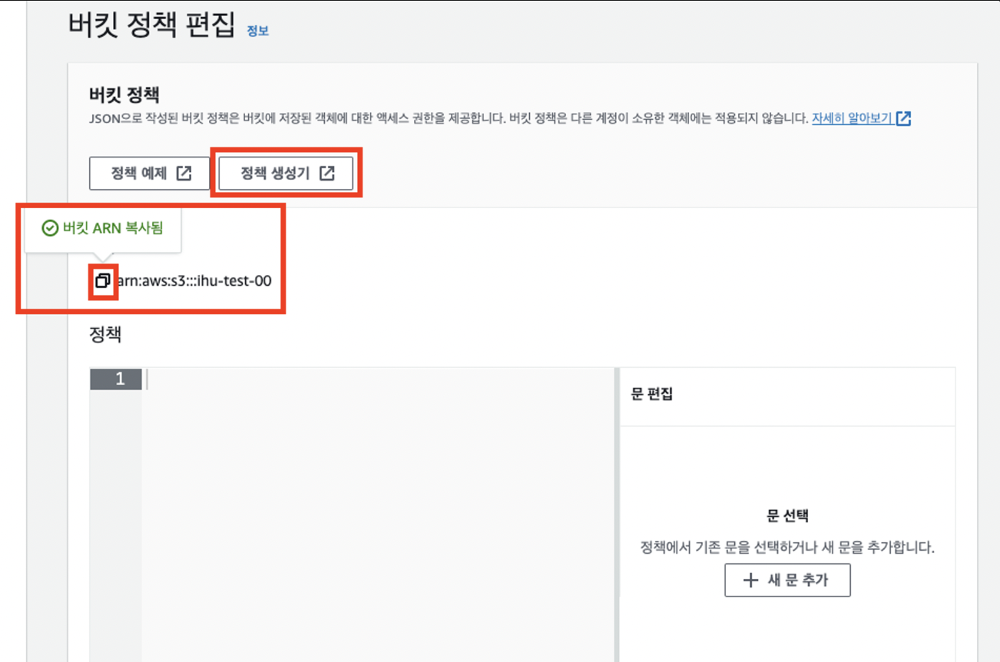

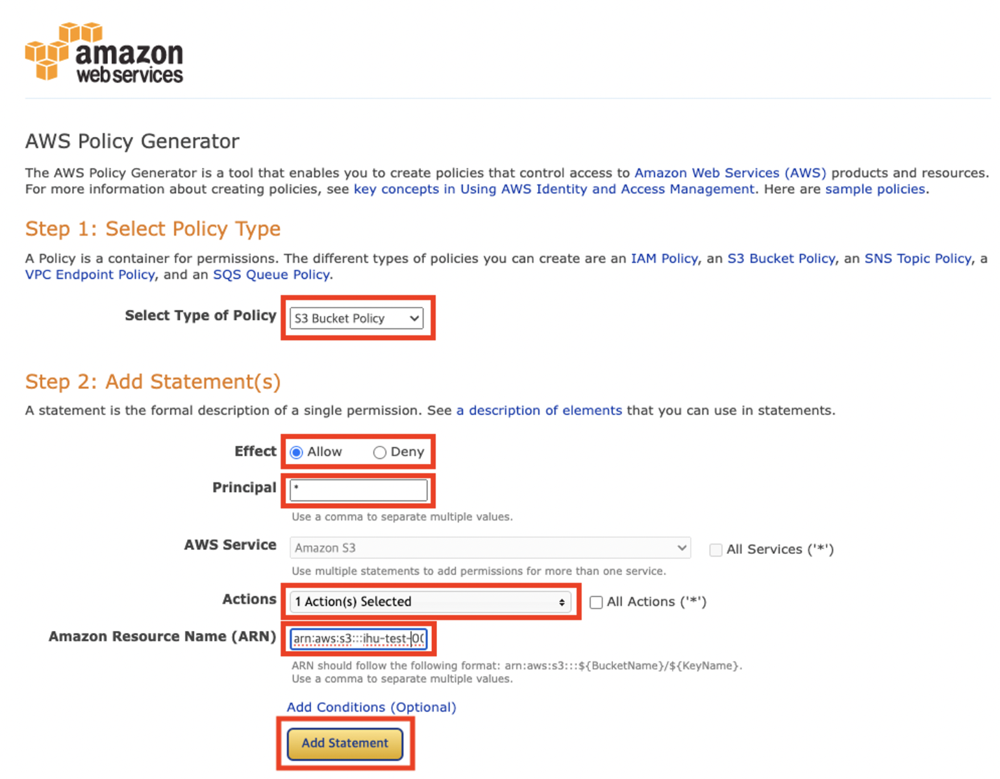

아래와 같이 채워주시면 되는데,

**주의해야 할 곳은, Action과 ARN부분입니다.**

- Actions : GetObject로 설정
- ARN : 복사한 ARN + `/*` 이렇게 쓰셔야 합니다. (반드시, 중요)
- 저 같은 경우는 ARN이 arn:aws:s3:::practice-cicd였는데,
  - arn:aws:s3:::practice-cicd/\*
  - 위와 같이 적어주셔야 합니다.

그 다음 Add Statement를 눌러줍니다.

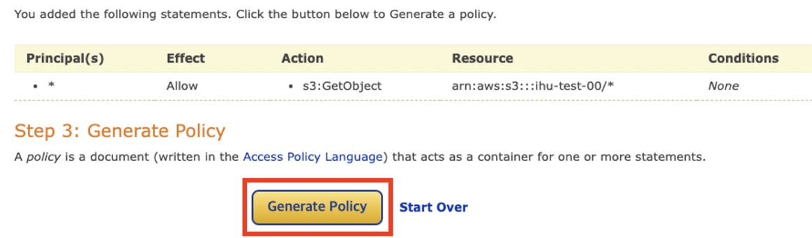
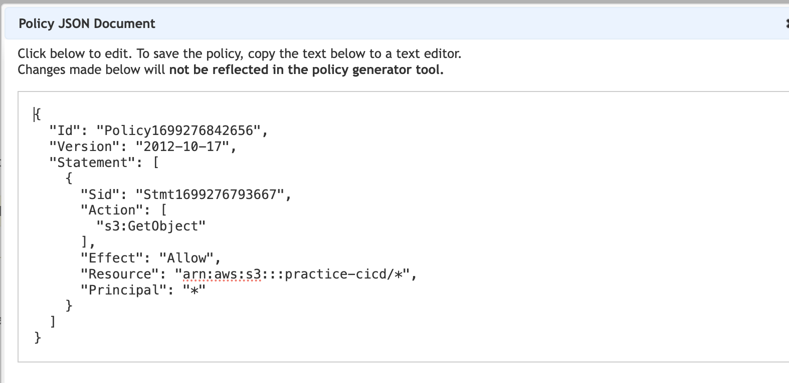

그러면 이렇게생성된 정책이 나올거고, 이거 통으로 복사해줍니다.

이제 정책 생성기 웹사이트를 닫고,

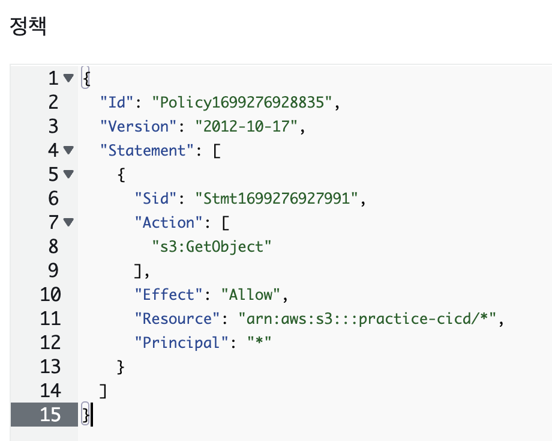

여기에 복붙해서 넣어주고, 정책생성 버튼 눌러줍니다. 여기서 안되면, 제가 위에서 강조했던 /\* 부분을 안하신 겁니다. (나도 여기서 한번 막혔음ㅋㅋ)

여기까지 따라오셨다면, S3에서 정적 웹사이트 배포하기위한 권한 설정까지는 다 마친 겁니다. 다음 단계, CodePipeline을 통해, 깃허브에 업로드하면 자동으로 빌드되는 단계입니다.
